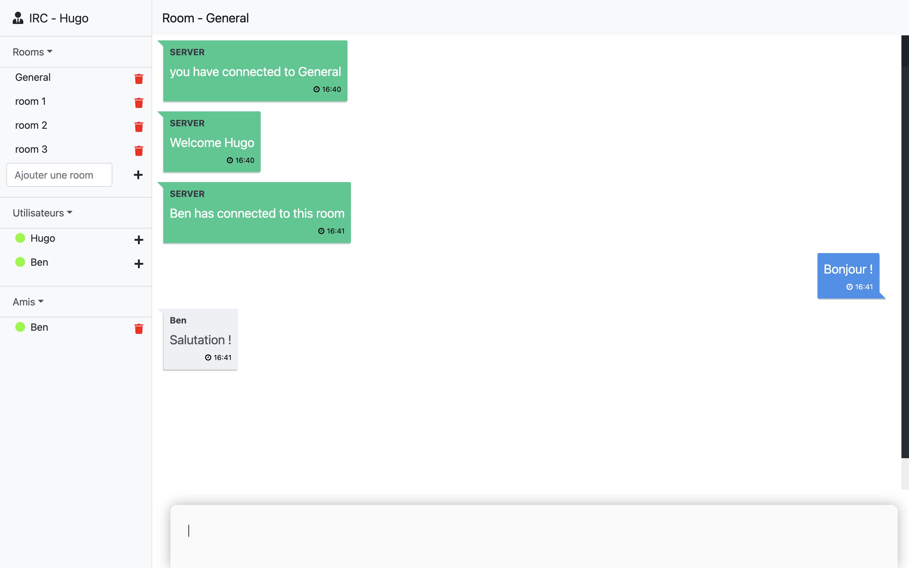

# Description

The objective was to made an IRC app made using NodeJs Express server and Angular client.  
You have the possibilty to :
* Add / Delete room
* Join room
* Send / Receive private messages
* Add / Delete friends

# Techno  

* Docker
* Databse : MongoDB
* Backend : Node Js + Express
* Frontend : Angular

# Quick launch

Launch the project using docker :
```code
$> docker-compose up --build
```

> visit IRC app on : http://localhost:8181
> visit NodeJs server on : http://localhost:8080

# Result overview



# Contributors
* Hugo ALLEGAERT
 
